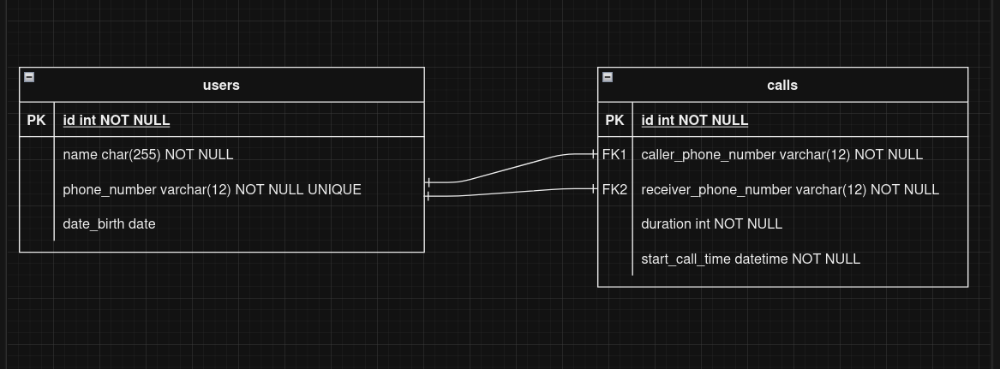

Thiết kế 1 cơ sở dữ liệu lưu trữ thông tin viễn thông bao gồm các yêu cầu sau:

-   Lưu thông tin của người dùng bao gồm (tên, ngày sinh, số điện thoại)
-   Lưu thông tin của cuộc gọi (sđt thực hiện cuộc gọi, sđt được gọi, thời lượng cuộc gọi, thời điểm thực hiện cuộc gọi)

**Yêu cầu:**

-   **Vẽ ERD cho cơ sở dữ liệu trên.**
-   **Viết câu lệnh truy vấn ra top 3 user có tổng thời lượng cuộc gọi lớn nhất trong tháng vừa rồi.**
-   **VIết câu lệnh truy vấn ra những user có tổng thời lượng cuộc gọi lớn thứ 2. (Lưu ý có thể có trường hợp 2 hoặc nhiều user có tổng thời lượng cuộc gọi bằng nhau)**

* * * * *

### ERD



### **Truy vấn ra top 3 user có tổng thời lượng cuộc gọi lớn nhất trong tháng vừa rồi.**

```
WITH last_month_calls AS (
    SELECT
        caller_phone_number,
        SUM(duration) AS total_duration
    FROM
        calls
    WHERE
        MONTH(start_call_time) = MONTH(CURDATE() - INTERVAL 1 MONTH) AND
        YEAR(start_call_time) = YEAR(CURDATE() - INTERVAL 1 MONTH)
    GROUP BY
        caller_phone_number
)
SELECT
    users.name,
    users.phone_number,
    last_month_calls.total_duration
FROM
    last_month_calls
JOIN
    users
ON
    users.phone_number = last_month_calls.caller_phone_number
ORDER BY
    last_month_calls.total_duration DESC
LIMIT 3;

```

### **Truy vấn ra những user có tổng thời lượng cuộc gọi lớn thứ 2.**

```
WITH last_month_calls AS (
    SELECT
        caller_phone_number,
        SUM(duration) AS total_duration
    FROM
        calls
    WHERE
        MONTH(start_call_time) = MONTH(CURDATE() - INTERVAL 1 MONTH) AND
        YEAR(start_call_time) = YEAR(CURDATE() - INTERVAL 1 MONTH)
    GROUP BY
        caller_phone_number
),
ranked_calls AS (
    SELECT
        caller_phone_number,
        total_duration,
        DENSE_RANK() OVER (ORDER BY total_duration DESC) AS ranker
    FROM
        last_month_calls
)
SELECT
    users.name,
    users.phone_number,
    ranked_calls.total_duration
FROM
    ranked_calls
JOIN
    users
ON
    users.phone_number = ranked_calls.caller_phone_number
WHERE
    ranked_calls.ranker = 2;

```